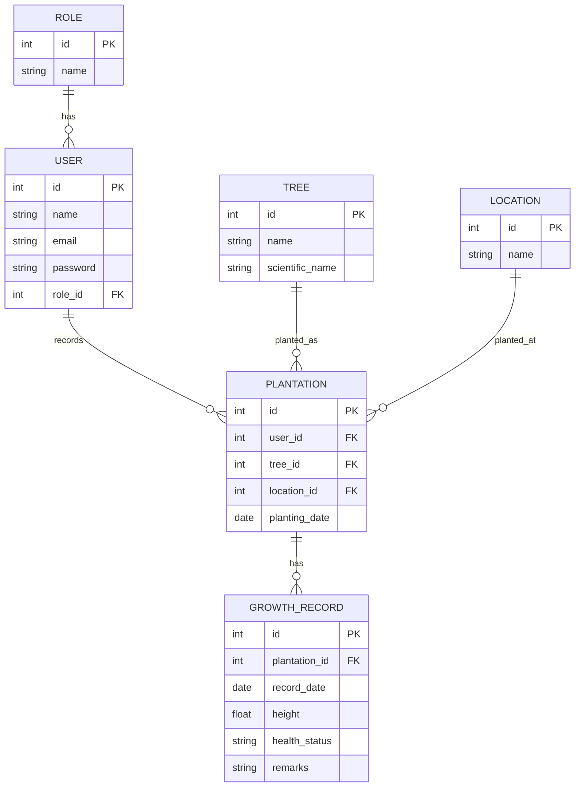

```mermaid
erDiagram

    ROLE ||--o{ USER : has
    USER ||--o{ PLANTATION : records
    TREE ||--o{ PLANTATION : planted_as
    LOCATION ||--o{ PLANTATION : planted_at
    PLANTATION ||--o{ GROWTH_RECORD : has

    ROLE {
        int id PK
        string name
    }

    USER {
        int id PK
        string name
        string email
        string password
        int role_id FK
    }

    TREE {
        int id PK
        string name
        string scientific_name
    }

    LOCATION {
        int id PK
        string name
    }

    PLANTATION {
        int id PK
        int user_id FK
        int tree_id FK
        int location_id FK
        date planting_date
    }

    GROWTH_RECORD {
        int id PK
        int plantation_id FK
        date record_date
        float height
        string health_status
        string remarks
    }
```